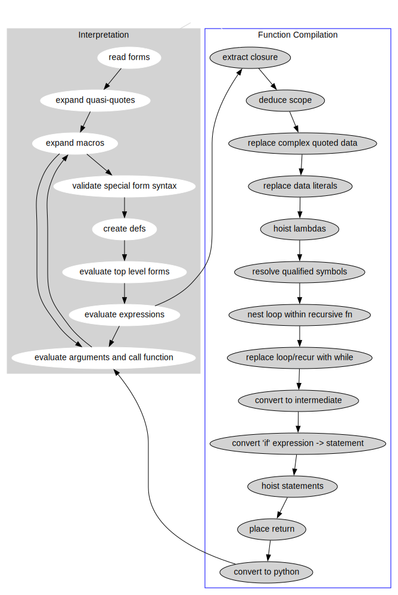

---
title:
- Pack - A Lisp in Python
author:
- Daniel Golding
theme:
- Crane
date:
- 26 Jan 2023
---

## Agenda
<!--
Ideas
- show multiple slides for showing macro expansion

-->

- A quick intro to LISP for the unfamiliar
- We talk about how we can interpret a lisp in Python


## LISP - A quick intro for people who have not seen it

::: notes
Ask if people are familiar and skip over if they are
:::

- Created by John McCarthy in 1960
- There are many dialects
  - Scheme <!-- Chez Scheme, Racket, ... -->
  - Common Lisp
  - Clojure
  - Emacs Lisp <!-- TODO check name -->

- Everything is an s-expression.
  - Lists starting with `(` and ending with `)`
- The first item at the beginning on the list is the function name


## LISP - A quick intro for people who have not seen it

### In Python we say...
```python
>>> 1 + 2
3
>>> 2 * 4 + 6 * 8
56
```

### In a LISP we say...
```clojure
user=> (+ 1 2)
3
user=> (+ (* 2 4) (* 6 8))
56
```


## LISP - A quick intro for people who have not seen it

### In Python we say...

```python
>>> def is_valid(age):
...     if age < 0 or age > 129:
...         return True
...     return False
```

### In a LISP we might say...
```clojure
user=> (def valid?
         (fn [age]
          (if (or (< age 0) (> age 129))
           true
           false)))
```

## Pack

- Most ideas based on Clojure

### Non-trivial features:

- Namespaces
- Macros

<!-- -->


## Pack - Some Code

_A small demo occurs_ 😱

<!-- See wc-example and flask-example -->

## Parsing

```python
def read_***(input_text):
    ...
    return parsed_***, remaining_text
```
. . .

```python
>>> from pack.interp import read_num
>>> read_num('1 1 2 3 5 8 13')
(1, ' 1 2 3 5 8 13')
```


## Parsing - Identifiers

```python
def is_ident_start(c):
    return (
        'a' <= c <= 'z'
        or 'A' <= c <= 'Z'
        or c in ('+', '-', '*', '/', '<', '>', '!', '=', '&', '_', '.', '?')
        or '🌀' <= c <= '🫸'
    )


def is_ident(c):
    return is_ident_start(c) or (c in ("'")) or '0' <= c <= '9'


def read_ident(text):
    i = 0
    for c in text:
        if is_ident(c):
            i += 1
        else:
            break

    return split_ident(text[:i]), text[i:]
```


## Parsing - Reading Lists

```python
def try_read(text):
    if text == '':
        return Reader.NOTHING, text
    c = text[0]
    ...  # eat whitespace
    c1 = text[1] if text[1:] else ''
    match c:
        case '(' | '[' | '{':
            return read_list(c, text[1:], closer[c])
        case ')' | ']' | '}':
            raise Unmatched(c, text[1:], location_from(text))
    ...
```

## Parsing - Reading Lists

```python
def read_list(opener, text, closing):
    remaining = text
    elements = []
    while True:
        try:
            elem, remaining = try_read(remaining)
            elements.append(elem)
        except Unmatched as unmatched:
            if unmatched.c == closing:
                return close_sequence(opener, elements), unmatched.remaining
            else:
                ... # raise syntax error
```

## Parsing - Reading Lists

```python
def read_list(opener, text, closing):
    remaining = text
    elements = []
    while True:
        try:
            elem, remaining = try_read(remaining)
            if elem is Reader.NOTHING:
                raise Unclosed(opener, location_from(text))
            else:
                elements.append(elem)
        except Unmatched as unmatched:
            if unmatched.c == closing:
                return close_sequence(opener, elements), unmatched.remaining
            else:
                ... # raise syntax error
```

## ~~Parsing~~ _Reading_ - Putting it together

```python
def try_read(text):
    if text == '':
        return Reader.NOTHING, text
    c = text[0]
    ...  # eat whitespace
    c1 = text[1] if text[1:] else ''
    match c:
        case '(' | '[' | '{':
            return read_list(c, text[1:], closer[c])
        case ')' | ']' | '}':
            raise Unmatched(c, text[1:], location_from(text))
        case "'":
            return read_quoted(text[1:])
        case '-' | '+' if '0' <= c1 <= '9':
            return read_num(text[1:], c)
        case n if '0' <= n <= '9':
            return read_num(text)
        case '"':
            return read_str(text)
        case ':':
            return read_keyword(text)
        case s if is_ident(s):
            return read_sym(text)
    raise NotImplementedError(c)
```

##

```clojure
user=> (def map
  (fn map [f xs]
    (let* [fcons
           (fn [x ys]
             (cons (f x) ys)]]
             (foldr fcons '() xs))))

SyntaxError("trying to close a '(' with a ']'")
Unmatched(')')
```

. . .

Can you spot where the problem is? 🔍

. . .

I think we need to improve these errors 🤦


## How NOT to implement error handling

- Start by ignoring error handling - it delays the fun
- Run into errors developing
- subclass the builtin python `str` class


## FileString

```python
>>> from pack.reader import FileString
>>> fs = FileString("hello", "a.txt", 1, 0)
>>> fs
a.txt:1:0 'hello'
```

. . .

```python
>>> fs = FileString("African violet\nApple blossom\nCamelia", "flowers.txt", 1, 0)
>>> fs
flowers.txt:1:0 'African violet\nApple blossom\nCamelia'
>>> fs[10:]
flowers.txt:1:10 'olet\nApple blossom\nCamelia'
>>> fs[20:]
flowers.txt:2:5 ' blossom\nCamelia'
>>> fs[30:]
flowers.txt:3:1 'amelia'
```

## FileString - How?

- `str` is immutable - so we must override `__new__` as well as `__init__`
- `s[i:]` - track `'\n'` s between `0` and `i` when the string is sliced

```python
class FileString(str):
    """A string that knows where it came from in a file"""

    def __new__(cls, s, file, lineno, col):
        obj = super().__new__(cls, s)
        obj.__init__(s, file, lineno, col)
        return obj

    def __init__(self, s, file, lineno, col):
        ...  # boilerplate init with super().__init__ call and field setting

    def __getitem__(self, idx):
        if isinstance(idx, slice):
            ... # see '\n', increment lineno, reset col
            return self.__class__(
                super().__getitem__(idx), self.file, lineno, col
            )
        return super().__getitem__(idx)
```

## FileString - Problems we might run into

We might want to use `repr` to get correct quoting, generating code.

```python
    exec(txt, globals, ns)
  File "<string>", line 3
    return __Sym(None, /Users/daniel/src/python/pack-lang/pack/core.pack:110:11 'do')
                       ^
SyntaxError: invalid syntax
```

## So what have we done so far

```python
>>> from pack.reader import read_all_forms
>>> read_all_forms("(def valid? (fn [age] (if (or (< age 0) (> age 129)) true false)))")[0]
Cons(hd=Sym(ns=None, n='def'),
     tl=Cons(hd=Sym(ns=None, n='valid?'),
             tl=Cons(hd=Cons(hd=Sym(ns=None, n='fn'),
                             tl=Cons(hd=Vec(xs=(Sym(ns=None, n='age'),), height=0),
                                     tl=Cons(hd=Cons(hd=Sym(ns=None, n='if'),
                                                     tl=Cons(hd=Cons(hd=Sym(ns=None, n='or'),
                                                                     tl=Cons(hd=Cons(hd=Sym(ns=None, n='<'),
                                                                                     tl=Cons(hd=Sym(ns=None, n='age'),
                                                                                             tl=Cons(hd=0, tl=Nil()))),
                                                                             tl=Cons(hd=Cons(hd=Sym(ns=None, n='>'),
                                                                                             tl=Cons(hd=Sym(ns=None, n='age'),
                                                                                                     tl=Cons(hd=129, tl=Nil()))),
                                                                                     tl=Nil()))),
                                                             tl=Cons(hd=True,
                                                                     tl=Cons(hd=False,
                                                                             tl=Nil())))),
                                             tl=Nil()))),
                     tl=Nil())))
```

##




## Match Case - What does this buy us?

TODO: write an example from the compiler without using match/case
  and compare

## Match Case - Can you spot the bug?

<!-- The first case in the lower match   -->
<!-- Case statements do not fall through -->

```python
def nest_loop_in_recursive_fn(expr):
    def contains_recur(expr):
        ...

    match expr:
        case Cons(Sym(None, 'fn'), Cons(params, Cons(body, Nil()))):
            if contains_recur(body):
                loop = Cons(Sym(None, 'loop'),
                            Cons(Vec.from_iter(untake_pairs(zip(params, params))),
                                 Cons(body, nil)))
                return Cons(Sym(None, 'fn'),
                            Cons(params,
                                 Cons(loop, nil)))
        case other:
            return other
```

## Match Case Pitfalls

* Easy to forget a positional argument when matching dataclasses
* Easy to accidentally return None:
  * Have a default case or return an error
  * Start writing the function with a `raise NotImplementedError` at the bottom
  * Use `typing.NoReturn` or (new in python 3.11) `typing.Never`
* The ordering of case statements matters a lot
* `[ ... ]` matches any sequence, not just lists
* Not possible to factor out constants


Failover cases look nice, but lead to errors


## Recursion Schemes


## This needs to 

rewriting to use a single pass

```python
def convert_if_expr_to_stmt(i=0):
    def next_temp(prefix=""):
        nonlocal i
        i += 1
        return Sym(None, f'{prefix}__t.{i}')

    fst = lambda pair: pair[0]
    snd = lambda pair: pair[1]

    def alg(expr):
        """
        ExprF[(ExprF, contains_stmt: Bool)] -> (ExprF, contains_stmt: Bool)
        """
        match expr:
            # c1 and c2 are whether those arms of the if expression
            # contain any statements - as calculated in the default
            # case
            case IfExpr((pred, _), (con, c1), (alt, c2)) if c1 or c2:
                t = next_temp()
                # statement hoisting will clean this up
                return Do((
                    IfStmt(pred,
                           con if is_stmt(con) else SetBang(t, con),
                           alt if is_stmt(alt) else SetBang(t, alt)),
                ), t), True
            case other:
                contains = reduce_ir(False, operator.or_, fmap_ir(snd, other))
                return (fmap_ir(fst, other), contains or is_stmt(other))
        assert False
    return alg
```

then realise we can use zygomorphism to remove most of this
base case


## Future Work / Ideas
-
- ~Finish compilation (i.e. transpilation) pipeline~
- python keyword argument compatibility

## Recursion Schemes - Resources

### Useful resources

- <https://github.com/sellout/recursion-scheme-talk>
- <https://github.com/precog/matryoshka>


## Source Code

### Pack Itself

- <https://github.com/cakemanny/pack-lang>

### This Talk

- <https://github.com/cakemanny/talks>


## `IndexError: slide index out of range`

## Rejected Material

## Syntax - Symbols

### Symbols

```clojure
    x
    my-variable
    <- ;; symbols are symbols too
    🚪 ;; 😈

   user/my-var
;  ^--^
;    \ namespace

    com.bettermarks.math/+
;      ^
;       \ dots make directories
```

```clojure
user=> (def 🤦 5)
#'user/🤦
user=> 🤦
5
user=> (+ 🤦 5)
10
```


## Data Structures

More than just lists!

- Lists `(a b c)`
- Vectors `[a b c]`
- Maps i.e. dictionaries `{:a b :c d}`

All are immutable


## Data Structures - Lists

```clojure
'(1 "one" 'two)
```


## Data Structures - Lists
### Implementation

The cons cell you all know and love.

```python
    @dataclass(frozen=True, slots=True)
    class Cons(List):
        hd: Any
        tl: 'Optional[List]'
        ...
```

Nil: Something to stick at the end. The empty list `()`

```python
    class Nil(List):
        __slots__ = ()
        ...

    nil = Nil()
    # all instances of Nil() are nil
    Nil.__new__ = lambda cls: nil
```

<!-- I wanted to put None there, but then you don't get such a nice repr -->
<!-- None works some of the time though -->


## Data Structures - Lists

In Python that looks like:

```python
Cons(1,
     Cons('one',
          Cons(Sym(None, "two"),
               nil)))
```


## Data Structures - Vectors

```clojure
[a b c 1 2 3]
```


## Data Structures - Vectors

```python
@dataclass(frozen=True, slots=True)
class Vec(Sequence):
    xs: tuple[Any | 'Vec']
    height: int

    def __getitem__(self, idx: int):

        if self._is_leaf():
            return self.xs[idx]

        subvec_idx = idx >> (5 * self.height)

        mask = (1 << (5 * self.height)) - 1

        return self.xs[subvec_idx][mask & idx]
    ...
```


## Data Structures - Vectors

Indexing involves splitting up the index (`idx`) into groups of 5 bits
to get the correct offset in each level of the tree

```python
>>> from pack.interp import Vec
>>> v1 = Vec.from_iter(range(100))
>>> bin(70)
'0b1000110'
```

```
     00010 00110
        \     \ Index for height 0
         Index for height 1
```

```python
>>> v1.xs[0b10].xs[0b00110]
70
>>> v1[70]
70
```


## Data Structures - Maps


{ width=90% }


## Data Structures - Maps


{ width=50% }

```
_hash32(:these)  = 3487490880 = 00000 00011 00111 11101 11101 11000 11010 00000
_hash32(:are)    = 1726257865 = 00000 00001 10011 01110 01001 00110 10110 01001
_hash32(:they)   = 3908472888 = 00000 00011 10100 01111 01101 00100 00001 11000
_hash32(:rather) =  843060011 = 00000 00000 11001 00100 00000 00100 11001 01011
                                          ^
                                           \
```

Here we see where `:these` and `:they` have clashed in group 6, and so
get pushed down into a level 5 node

_and writing this slide I notice the bug... we should be starting height from 6_

<!-- TODO: add another bitset to indicate which slots are empty  -->

<!--
##

Sometimes data structures are hard... 🤦

```
(Pdb) p entry[1]
[y 2]
(Pdb) p v
[]
(Pdb) p entry[1] == v
True
(Pdb)
```
-->

## Namespaces ?

```clojure
(ns my-namespace-name)
```

```clojure
```


