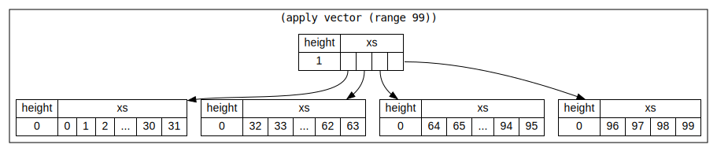
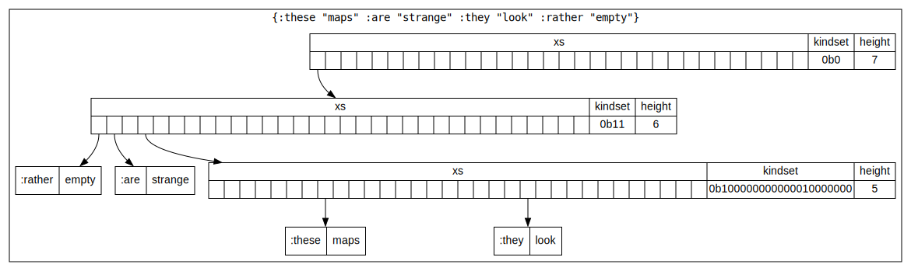

---
title:
- Pack - A Lisp in Python
author:
- Daniel Golding
theme:
- Crane
date:
- 26 Jan 2023

---
_This slide is empty_

<!--
Ideas
- show multiple slides for showing macro expansion

- Ask people on their familiarity wisp lisps?

-->


## Pack

Most ideas based on Clojure

### Non-trivial features:

- Namespaces
- Macros

<!-- -->


## Syntax - Symbols

### Symbols

```clojure
    x
    my-variable
    <- ;; symbols are symbols too
    🚪 ;; 😈

   user/my-var
;  ^--^
;    \ namespace

    com.bettermarks.math/+
;      ^
;       \ dots make directories
```

## Data Structures

More than just lists!

- Lists `(a b c)`
- Vectors `[a b c]`
- Maps i.e. dictionaries `{:a b :c d}`

All are immutable


## Data Structures - Lists

```clojure
'(1 "one" 'two)
```


## Data Structures - Lists
### Implementation

The cons cell you all know and love.

```python
    @dataclass(frozen=True, slots=True)
    class Cons(List):
        hd: Any
        tl: 'Optional[List]'
        ...
```

Nil: Something to stick at the end. The empty list `()`

```python
    class Nil(List):
        __slots__ = ()
        ...

    nil = Nil()
    # all instances of Nil() are nil
    Nil.__new__ = lambda cls: nil
```

<!-- I wanted to put None there, but then you don't get such a nice repr -->
<!-- None works some of the time though -->


## Data Structures - Lists

In Python that looks like:

```python
Cons(1,
     Cons('one',
          Cons(Sym(None, "two"),
               nil)))
```


## Data Structures - Vectors

```clojure
[a b c 1 2 3]
```





## Data Structures - Vectors

```python
@dataclass(frozen=True, slots=True)
class Vec(Sequence):
    xs: tuple[Any | 'Vec']
    height: int

    def __getitem__(self, idx: int):

        if self._is_leaf():
            return self.xs[idx]

        subvec_idx = idx >> (5 * self.height)

        mask = (1 << (5 * self.height)) - 1

        return self.xs[subvec_idx][mask & idx]
    ...
```


## Data Structures - Vectors

Indexing involves splitting up the index (`idx`) into groups of 5 bits
to get the correct offset in each level of the tree

```python
>>> from pack.interp import Vec
>>> v1 = Vec.from_iter(range(100))
>>> bin(70)
'0b1000110'
```

```
     00010 00110
        \     \ Index for height 0
         Index for height 1
```

```python
>>> v1.xs[0b10].xs[0b00110]
70
>>> v1[70]
70
```


## Data Structures - Maps


{ width=90% }


## Data Structures - Maps


{ width=50% }

```
_hash32(:these)  = 3487490880 = 00000 00011 00111 11101 11101 11000 11010 00000
_hash32(:are)    = 1726257865 = 00000 00001 10011 01110 01001 00110 10110 01001
_hash32(:they)   = 3908472888 = 00000 00011 10100 01111 01101 00100 00001 11000
_hash32(:rather) =  843060011 = 00000 00000 11001 00100 00000 00100 11001 01011
                                          ^
                                           \
```

Here we see where `:these` and `:they` have clashed in group 6, and so
get pushed down into a level 5 node

_and writing this slide I notice the bug... we should be starting height from 6_

<!-- TODO: add another bitset to indicate which slots are empty  -->


## Control Structures ?

```clojure
`(def ~name)
`(def ~name ~init)

`(if ~condition ~consequent)
`(if ~condition ~consequent ~alternative)

`(do ~@actions)

(fn [x y] (+ x y))

```

## Namespaces ?


## Parsing

```python
def read_***(input_text):
    ...
    return parsed_***, remaining_text
```


## Parsing

```python
def read_***(input_text):
    ...
    return parsed_***, remaining_text
```

```python
>>> from pack.interp import read_num
>>> read_num('1 1 2 3 5 8 13')
(1, ' 1 2 3 5 8 13')
```


## Parsing - Identifiers

```python
def is_ident_start(c):
    return (
        'a' <= c <= 'z'
        or 'A' <= c <= 'Z'
        or c in ('+', '-', '*', '/', '<', '>', '!', '=', '&', '_', '.', '?')
        or '🌀' <= c <= '🫸'
    )


def is_ident(c):
    return is_ident_start(c) or (c in ("'")) or '0' <= c <= '9'


def read_ident(text):
    i = 0
    for c in text:
        if is_ident(c):
            i += 1
        else:
            break

    return split_ident(text[:i]), text[i:]
```

## How NOT to implement error handling

- Start by ignoring error handling - it delays the fun
- Run into errors developing
- subclass the builtin python `str` class


## FileString

...


## Future Work / Ideas
-
- Finish compilation (i.e. transpilation) pipeline

## Recursion Schemes - Resources

### Useful resources

- https://github.com/sellout/recursion-scheme-talk
- https://github.com/precog/matryoshka


## Source Code

### Pack Itself

- https://github.com/cakemanny/pack-lang

### This Talk

- https://github.com/cakemanny/talks
